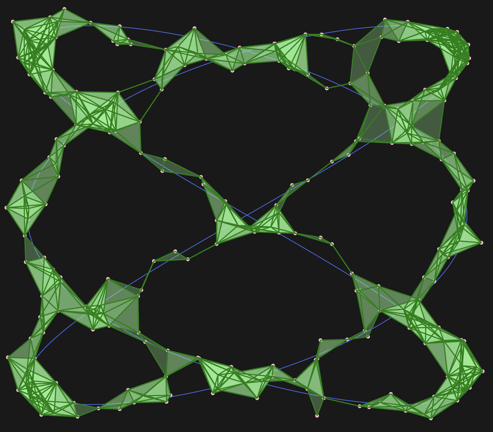
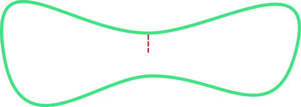
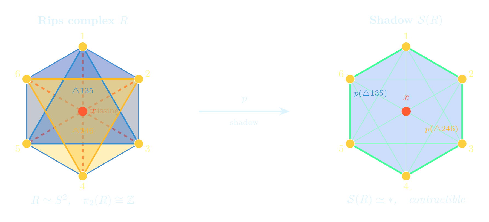
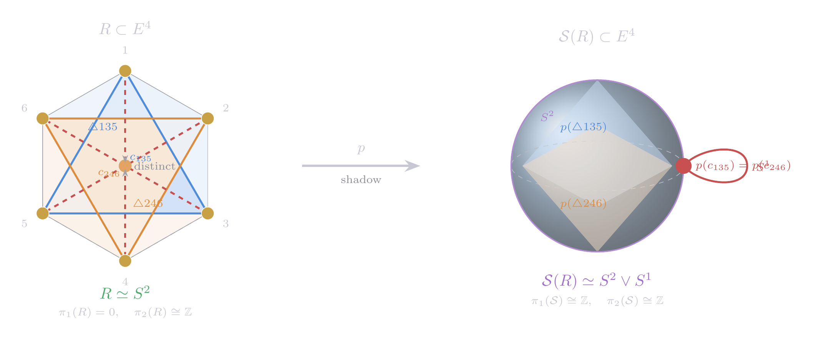
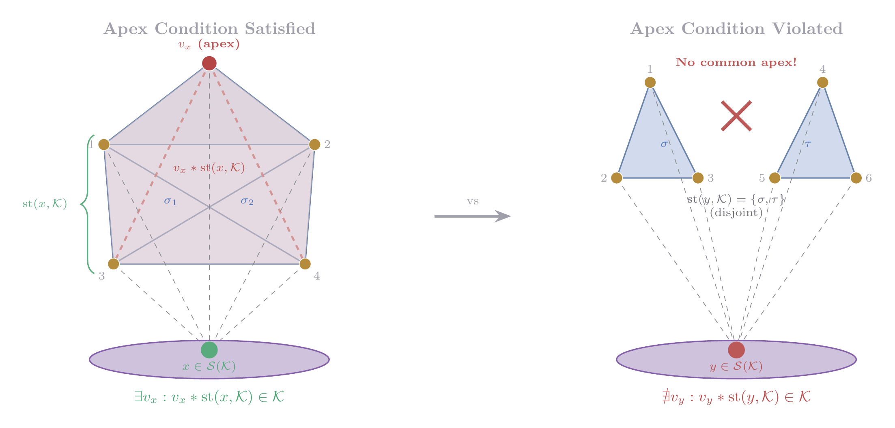

# Finite Reconstruction Problem {background-image="chaya.png" background-opacity="0.1"}

- <green>**Shape**</green>: A *Shape* is modeled as a metric space $(X,d_X)$
  - <green>ex</green>: manifolds, graphs, general stratified spaces
  - <green>type</green>: abstract metric space, Euclidean embedded 

- <green>**Sample**</green>: A *finite*, metric space $(S,d_S)$
- <green>**Closeness**</green>: small <green>Gromov--Hausdorff</green> distance $d_{\mathrm GH}(X, S)$ or <green>Hausdorff</green> distance $d_{\mathrm H}(X, S)$
   
- <green>**Goal**</green>: Develop algorithms to recover the homotopy-type and geometry of $X$ from $S$ with guarantees.
  
## Reconstruction via Vietoris<green>--</green>Rips

::: {.columns}

:::{.column width="65%" }

- Computationally efficient
- Data dimension agnostic---unlike the Čech complex or $\alpha$-complex

- <gray>Persistent homology considers all possible scales $\beta$ to make reasonable (only) <red>homological</red> inference</gray>

:::

::: {.column width="35%"}

:::

:::

. . . 

::: {.callout-note appearance="minimal"}

- My goal is to provide a [window] of scales where <green>homotopy</green> properties are guaranteed.

:::

## <green>Latschev's</green> Theorem {.smaller}

. . . 

:::{.callout-tip icon="false"}
## @hausmann_1995
For any closed Riemannian manifold $X$ and $0<\beta<\rho(X)$ small enough, the Vietoris--Rips complex $\mathcal{R}_\beta(X)$ is *homotopy equivalent* to $X$.
:::

- Recovering the homotopy information of $X$ is computationally <red>infeasible</red>

. . .

::: {.callout-tip icon="false"}
## @latschev_2001
Every closed Riemannian manifold $X$ has an <green>$\epsilon_0>0$</green> such that for any $0<\beta\leq\epsilon_0$ there exists some <red>$\delta>0$</red> so that for any sample $S$:
$$
d_{GH}(S,X)\leq\delta\implies \mathcal R_\beta(S)\simeq X.
$$
:::

- Has the promise of feasibility but <red>qualitative</red>!

## Quantitative Latschev's Theorems {.smaller style="font-size:0.6em"}

:::{.callout-tip icon="false"}
## Metric Graph Reconstruction [*J. Appl. & Comp. Top., @Majhi2023*]
Let $(G,d_G)$ be a compact, path-connected metric graph, $(S,d_S)$ a metric space, and $\beta>0$ a number such that $$3d_{GH}(G,S)<\beta<\frac{3}{4}\rho(G).$$ 
Then, $\mathcal R_\beta(S)\simeq G$

:::

- $\epsilon_0=\frac{3}{4}\rho(G)$, $\delta=\frac{1}{3}\beta$

. . .

:::{.callout-tip icon="false"}
## Riemannian Manifold Reconstruction [*SoCG'24, DCG, @MajhiLatschev*]

Let $M$ be a closed, connected Riemannian manifold. Let $(S,d_S)$ be a compact metric space and $\beta>0$ a number such that
$$
	\frac{1}{\xi}d_{GH}(M,S)<\beta<\frac{1}{1+2\xi}\min\left\{\rho(M),\frac{\pi}{4\sqrt{\kappa}}\right\}
$$ 
for some $0<\xi\leq1/14$. Then, $\mathcal R_\beta(S)\simeq M$.

:::

- <green>For $\xi=\frac{1}{14}$</green>: $\epsilon_0=\frac{7}{8}\min\left\{\rho(M),\frac{\pi}{4\sqrt{\kappa}}\right\}$, $\delta=\frac{\beta}{14}$

## Quantitative Latschev's Theorem {.smaller}

:::{.callout-tip icon="false"}
## Euclidean Submanifold Reconstruction [@MajhiLatschev]

Let $M\subset\mathbb R^N$ be a closed, connected submanifold. Let $S\subset\mathbb R^N$ be a compact subset and $\beta>0$ a number such that
$$
	\frac{1}{\xi}d_{H}(M,S)<\beta<\frac{3(1+2\xi)(1-14\xi)}{8(1-2\xi)^2}\tau(M)
$$ for some $0<\xi<1/14$. Then, $\mathcal R_\beta(S)\simeq M$.

:::

:::{.columns}

:::{.column width="40%"}
- $\tau(M)$ is the reach of $M$

- For $\xi=\frac{1}{28}$:
  - <green>$\epsilon_0=\frac{315}{1352}\tau(M)$</green>

  - <red>$\delta=\frac{\beta}{28}$</red>

:::

:::{.column width="60%"}

{width=100% cap-align="center"}

:::

:::

## Quantitative Latschev's Theorems {.smaller}

- Metric Graphs [@Majhi2023]
- Riemannian Manifolds [@MajhiLatschev]
- $CAT(\kappa)$ Spaces [<code>ArXiv:2406.04259</code>, @2406.04259]

# Geometric <green>Reconstruction</green>Theorem {background-image="drawing.png" background-opacity="0.3" }

- <green>What if</green>: both $X\subset\mathbb R^N$ and $S\subset\mathbb R^N$
- <green>**Closeness**</green>: small <green>Hausdorff</green> distance $d_{\mathrm H}(X, S)$
- <green>Goal</green>: construct <red>$\hat{\mathcal G}\subset\mathbb R^N$</red> from samples so that 
    - $\hat{X}\simeq X$ & $d_H(\hat{X}, X)$ is small
- Vietoris--Rips complexes are <red>abstract</red>, hence contain only topological information

- A good candidate for $\hat{X}$ is the *shadow* of a topologically-faithful Vietoris--Rips.

## Simplicial <green>Shadow</green> {.smaller}

:::{.columns}

:::{.column width="70%"}

- For simplicial complex $\mathcal K$ with vertices from $\mathbb R^N$, its shadow $\mathcal S(\mathcal K)$ is the union of the (Euclidean) convex hulls of simpices $\sigma\in\mathcal K$

- natural (shadow) projection map $p:\mathcal K\to \mathcal S(\mathcal K)$

:::

:::{.column width="30%"}

{width="90%" fig-align="center"}

:::

:::

. . . 

:::{.columns}

:::{.column width="70%"}

  
- Notorious for being <red>topologically unfaithful</red>
    - @Chambers2010; @adamaszek_homotopy_2017

:::

:::{.column width="30%"}

{width="80%" fig-align="center"}

:::

:::

## Shadow is Unfaithful [@Chambers2010] {.smaller}

{width=60% fig-align=center}

. . . 

{width=60% fig-align=center}

## A Geometric Latschev Theorem {.smaller}

::::{.callout-tip icon="false" .nonincremental style="font-size: 1em"}
## Geometric Graph Reconstruction [@graph_shadow]
<gray>Let $\mathcal G \subset \mathbb{R}^2$ a graph.
Fix any $\xi\in\left(0,\frac{1-\Theta}{6}\right)$.
For any positive $\beta<\min\left\{\Delta(\mathcal G),\frac{\ell(\mathcal G)}{12}\right\}$, choose a positive $\varepsilon\leq\frac{(1-\Theta)(1-\Theta-6\xi)}{12}\beta$ such that $\delta^{\varepsilon}_{\beta}(\mathcal G)\leq\frac{1+2\xi}{1+\xi}$.</gray>

If $S\subset \mathbb R^2$ and $d_H(\mathcal G, S)<\tfrac{1}{2}\xi\varepsilon$, then the shadow $\mathcal{S}(\mathcal R_\beta^\varepsilon(S))$ is <green>homotopy equivalent</green> to $\mathcal G$. 
Moreover, <green>$d_H(\mathcal S(\mathcal R_\beta^\varepsilon(S)),\mathcal G)<\left(\beta+\frac{1}{2}\xi\varepsilon\right)$</green>. 
:::

- <green>$\Theta\in(0,1)$</green>: depends on the angles between tangents of edges at the graph vertices
- <green>$\Delta(G)$</green>: *Shadow radius* positive number for graphs with smooth edges

## A Sufficient Condition for Faithfulness {.smaller}

:::{.callout-tip icon="false"}
## Apex Theorem
Let $\mathcal K$ be a simiplicial complex with vertices in $\mathbb R^N$ with the apex condition. Then, the shadow projection $p$ is a homotopy equivalence.
:::

## <green>Submanifold</green> Reconstruction using Shadow {.smaller}

:::{.callout-tip icon="false"}
## Knot-Type Reconstruction
Let $\mathcal K$ be a simiplicial complex with vertices in $\mathbb R^N$ with the apex condition. Then, the shadow projection $p$ is a homotopy equivalence.
:::

# Future Directions 

    - *in preparation* with <green>Kazuhiro Kawamura</green> & <green>Atish Mitra</green>
- Use <green>discrete Morse theory</green> to perform *organized collapses* of higher dimensional simplices of shadow for homeomorphic reconstruction

- <green>Submanifold reconstruction</green> via Vietoris--Rips shadow

## References {background-image="drawing.png" background-opacity="0.3" style="font-size: 0.6em"}
